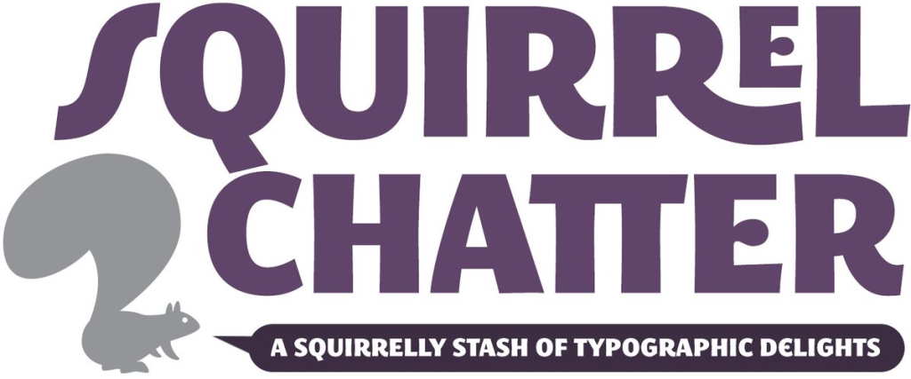
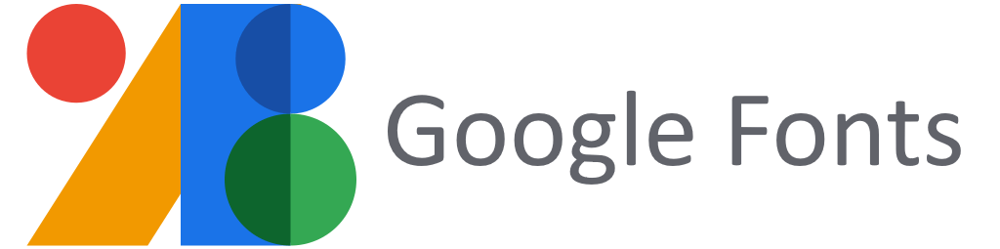
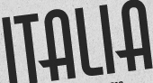
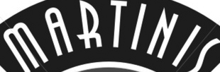
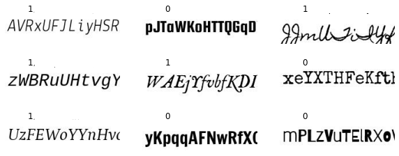
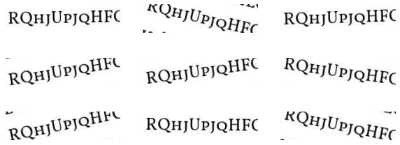
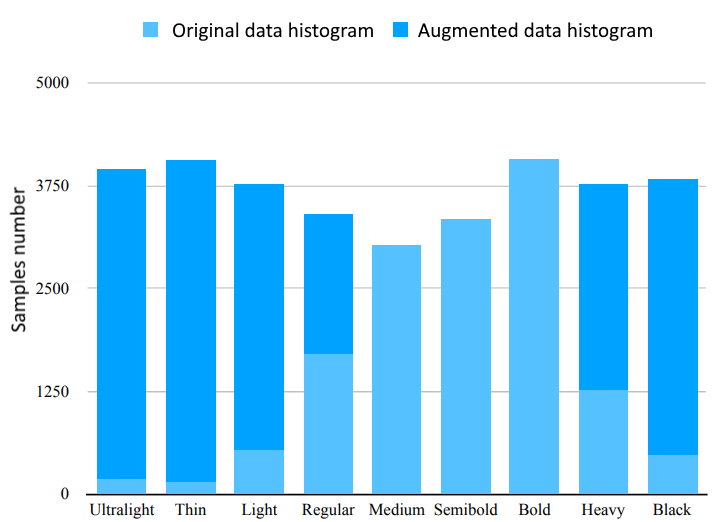

# Font-Recognizer

## Description

This project was created to recognize the font from the uploaded image. After loading the image, it is run through 7 pre-trained neural networks in order to determine the typographic parameters of the font. The recognized parameters include:
  1) Is the font similar to Handwritten or Not Handwritten
  &emsp; 
  3) Does the font belong to the monospaced or display class
  &emsp;
         
  3) Does the font contain serifs or does it not contain
  &emsp; 
  4) Font thickness
  &emsp;
        
        
        
        
        
        
        
         
  5) Font tilt
  &emsp; 
  6) Font width
  &emsp;
        
         
  7) Font contrast
  &emsp; 
  

## How to Use this Source

- You can navigate using the [table of content](./lab/Index.ipynb).
- You can watch final result of recognition in this repository's [tests](tests) directory.
- Launch executable versions of these notebooks using [Google Colab](http://colab.research.google.com): 

## What fonts we used
We used free fonts from [Google Fonts](https://fonts.google.com/) and [Font Squirrel](https://www.fontsquirrel.com/). For more fonts example you can visit [Font Tag page](https://www.fontsquirrel.com/fonts/list/tag). The parameters determined by the neural network were selected based on Font Squirrel tags.

## Datasets
Initially, we planned to use the [Adobe VFR dataset](https://www.dropbox.com/sh/o320sowg790cxpe/AADDmdwQ08GbciWnaC20oAmna?dl=0). Here are some sample images: 

 
But we are faced with the following problems:
1) Unbalanced dataset
2) The lack of fonts [we need](./lab/FontsBckgr.png) in the dataset
3) Inability to generate similar images of other fonts
4) Lack of uniformity in the font (some of the images have [light letters on a dark background](./lab/AdobeDataEx4.png), some of the images have [dark letters on a light background](./lab/AdobeDataEx1.png), while the other part of the images have [letters color similar to background color](./lab/AdobeDataEx2.png) (for example, gray and dark gray).

In this regard, it was decided to generate its own dataset as a set of dark letters on a white background:
  
With augmentation in the form of text tilt at small angles:
  
Example of distribution by Weight parameter taking into account balancing:
  

## Network structure
Example of a neural network structure for contrast classification (binary feature): 
  

## About

